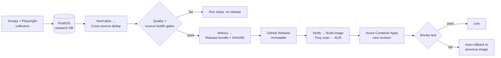
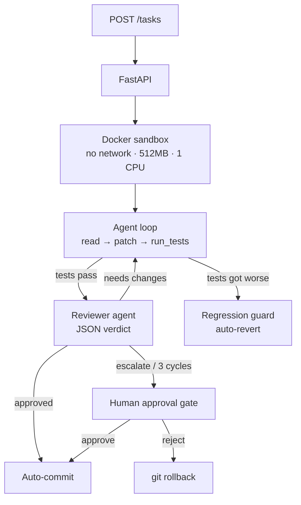

<!-- ============================================================
  PROFILE README  |  repo name MUST be exactly: LorandPervizaj/LorandPervizaj
  Contribution snake needs .github/workflows/snake.yml (included).
============================================================ -->

<div align="center">


<a href="https://github.com/LorandPervizaj">
  
</a>

<br/>


<br/>


</div>

---

## ⚡ About me

```python
class Lorand:
    studying   = "Computer Information Technology @ RIT Kosovo"
    background = ["blue team", "detection engineering", "KQL / Sentinel / Sysmon"]
    credential = "ISC2 Certified in Cybersecurity (CC)"
    builds     = ["data pipelines", "security automation", "AI agent systems"]
    ships_to   = "Azure"
    philosophy = "If I can't break it and rebuild it, I don't understand it."
```

- 🛡️ **Security:** I design detections from attacker behavior, not from dashboards. Signal over noise.
- 🏗️ **Backend:** Python/FastAPI services with typed schemas, migrations, tests, and gated releases.
- ☁️ **CloudOps:** immutable artifacts, OIDC auth (zero stored cloud creds), smoke tests, automatic rollback.
- 🤖 **AI:** agent loops with sandboxing, reviewer models, and human approval gates. No "just call the API" demos.

---

## 🚀 Flagship: Metrik / GroundTruth

> **Real-estate market intelligence for Prishtina.** A private research pipeline feeds a public Azure site that serves aggregated stats, each published with its sample size and confidence level.

<div align="center">

<a href="https://ca-metrik-api.livelydune-1ec3eb9a.eastus2.azurecontainerapps.io"></a>
<a href="https://github.com/LorandPervizaj/GroundTruth"></a>

</div>

| 📊 Data | 🔁 Release cadence | 🧪 Quality gates | 🔒 Privacy |
|:--:|:--:|:--:|:--:|
| ~12k active listings after cross-portal dedup | Weekly, immutable, checksummed | pytest · Playwright · k6 · ruff · Trivy · gitleaks · pip-audit | Only aggregates leave the research host |



<details>
<summary><b>What makes it more than a scraper</b> (click)</summary>

- **Public/private boundary enforced in code:** raw HTML, listing text, photos and contact data never leave the research host. The bundle verifier rejects any listing-level field.
- **Self-hosted Windows runner** for research, with a test that fails the build if a workflow gains a trigger that could run fork code.
- **Telegram owner bot:** `/status`, `/scrape_start`, `/scrape_stop`, plus push alerts for runs, deploys, and site activity.
- **Infra as code (Bicep)**, GitHub Actions to Azure via **OIDC**, k6 performance baselines, JSON logging, rate limiting, Sentry.
- **Crawl policy:** public pages only, robots.txt honored, rate limits, no login-gated scraping.

</details>

---

## 🔥 Vulcan Forge: autonomous AI coding agent

> Submit a task, the agent reads the repo, writes a fix, runs tests, gets **reviewed by a second LLM**, and commits. Everything runs in a network-isolated Docker sandbox.



`FastAPI` · `React + Vite live dashboard (SSE)` · `Groq + OpenRouter fallback` · `bring-your-own key` · `loop detection` · `rewrite protection` · `SQLite` · `Azure VM + Nginx + CI/CD`

<div align="center">
<a href="https://github.com/LorandPervizaj/Vulcan-Forge"></a>
</div>

---

## 🛡️ Security & detection engineering

<table>
<tr>
<td width="50%" valign="top">

### 🤖 Detection-Bot
**SOC-as-Code alert pipeline.** Sentinel webhook → normalize → persistent dedupe → explainable score → per-host kill-chain state machine → incident → live dashboard.

`NORMAL → EXECUTION → PERSISTENCE → EXFILTRATION`

`FastAPI` `SQLite` `React` `MITRE ATT&CK heatmap`

[**View repo →**](https://github.com/LorandPervizaj/Detection-Bot)

</td>
<td width="50%" valign="top">

### 📚 Detection Engineering Course
**8-week design-driven curriculum** I wrote: KQL, Azure control-plane telemetry, webhooks, IAM/NSG/Key Vault detections, Sysmon & LOLBins, NSG flow logs, Sentinel automation.

`KQL` `Azure Monitor` `Sentinel` `Sysmon`

[**View repo →**](https://github.com/LorandPervizaj/Detection_Engineering_Course)

</td>
</tr>
</table>

---

## 🧰 Tech stack

<div align="center">

**Languages & Backend**


**Data, Cloud & DevOps**


**Frontend**


<br/>


</div>

---

## 📌 Featured repositories

<div align="center">

<a href="https://github.com/LorandPervizaj/GroundTruth"></a>
<a href="https://github.com/LorandPervizaj/Vulcan-Forge"></a>
<a href="https://github.com/LorandPervizaj/Detection-Bot"></a>
<a href="https://github.com/LorandPervizaj/Detection_Engineering_Course"></a>

</div>

<details>
<summary><b>Learning projects</b> (ML & GenAI fundamentals)</summary>

- 🧠 [**rag-ollama-assistant**](https://github.com/LorandPervizaj/rag-ollama-assistant): fully local RAG: Ollama (llama3 + nomic-embed-text), Qdrant, FastAPI.
- 📉 [**ml-churn-predictor**](https://github.com/LorandPervizaj/ml-churn-predictor): LogReg / Random Forest / XGBoost compared by ROC-AUC, served via FastAPI + Docker.

</details>

---

## 📈 GitHub stats

<div align="center">


</div>

---

## 🐍 Contribution snake

<div align="center">
<picture>
  <source media="(prefers-color-scheme: dark)" srcset="https://raw.githubusercontent.com/LorandPervizaj/LorandPervizaj/output/github-snake-dark.svg"/>
  <source media="(prefers-color-scheme: light)" srcset="https://raw.githubusercontent.com/LorandPervizaj/LorandPervizaj/output/github-snake.svg"/>
  
</picture>
</div>

---

## 🤝 Connect

<div align="center">

<a href="https://www.linkedin.com/in/lorandpervizaj"></a>
<a href="mailto:lorand.pervizaj@gmail.com"></a>
<a href="https://ca-metrik-api.livelydune-1ec3eb9a.eastus2.azurecontainerapps.io"></a>

<sub>Open to security, backend and data-engineering internships and collaborations.</sub>

<br/><br/>


</div>
